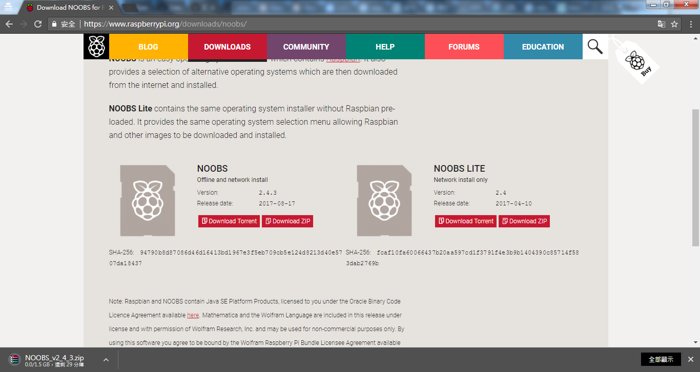
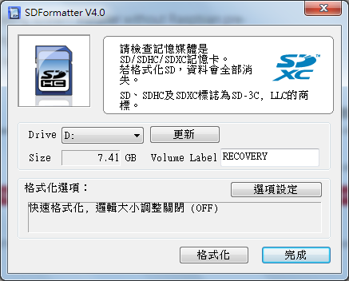
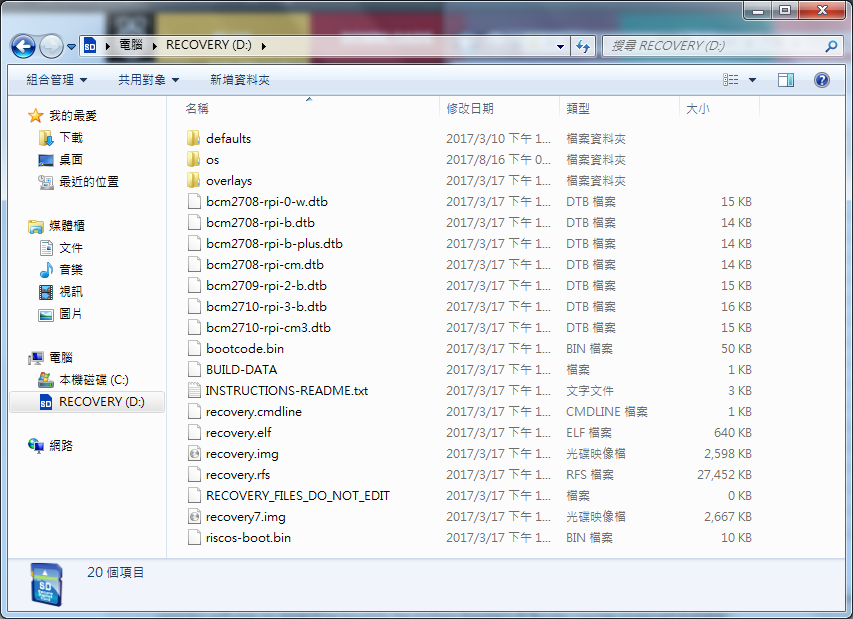
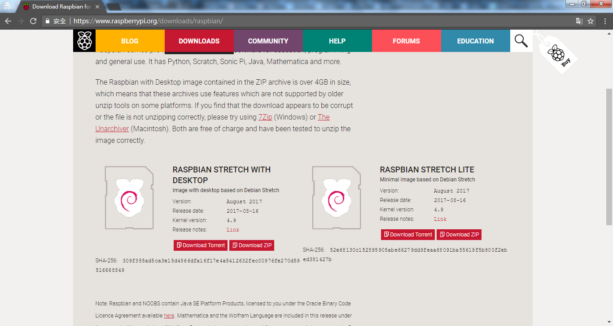
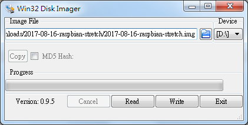

#01_install

樹莓派的安裝方法可從[官網](https://www.raspberrypi.org/downloads/)下載

分為NOOBS及RASPBIAN也有第三方系統的選擇

***

NOOBS的安裝

從[官網](https://www.raspberrypi.org/downloads/noobs/)下載ZIP並將其解壓縮

使用SDFormatter對SD卡進行格式化

將解壓縮後的檔案移至SD卡中

把SD卡放入樹莓派後開機即可進入安裝選單，因螢幕不支援HDMI後續補充畫面及方法

***

RASPBIAN的安裝

從[官網](https://www.raspberrypi.org/downloads/raspbian/)下載ZIP並將其解壓縮

使用Win32 Disk Imager將img寫入SD卡

因為螢幕沒有HDMI接頭，使用轉接頭時設定檔需修改

[config.txt](file/config.txt)

把SD卡放入樹莓派後開機即可進入桌面

