#02_locale

語言設定為繁體中文及新增輸入法

***

安裝中文桌面

`sudo aptitude -y install task-chinese-t-desktop`

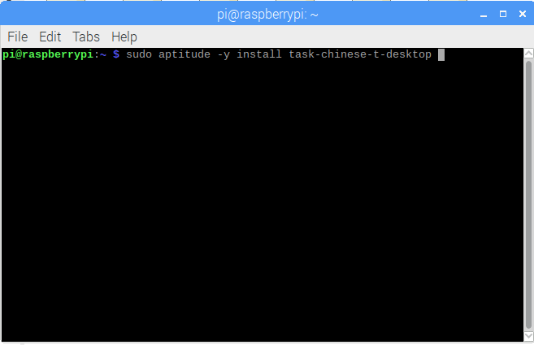

修改鍵盤設定

`sudo nano /etc/default/keyboard`

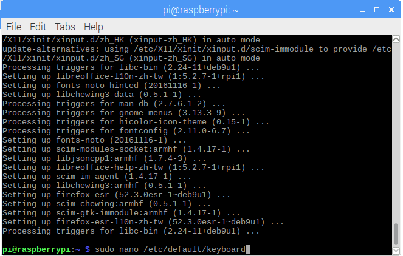

XKBLAYOUT="us"

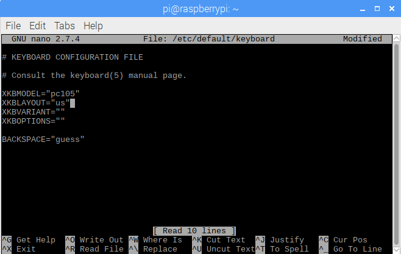

使用Ctrl+O存檔之後Ctrl+X離開後重新開機

***

進入樹莓派設定

`sudo raspi-config`

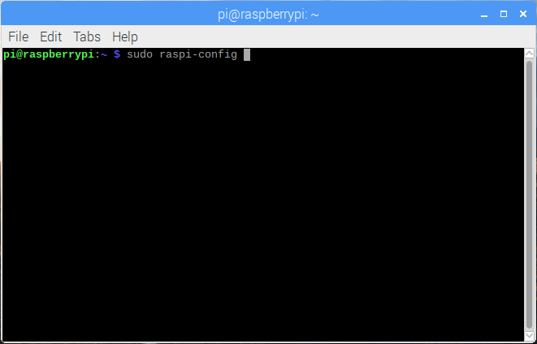

選擇4語言設定

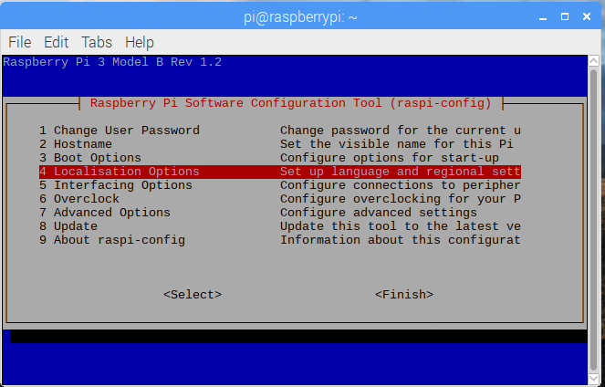

選擇1語言設定

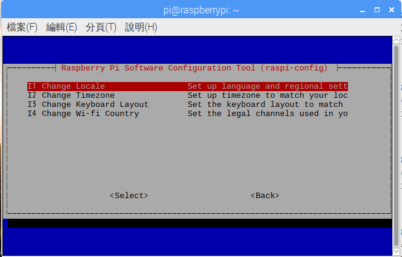

選擇zh_TW.BIG5,zh_TW.EUC-TW EUC-TW,zh_TW.UTF-8 UTF-8

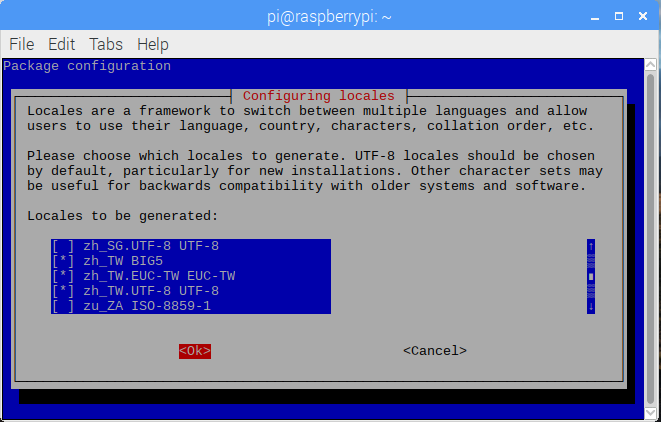

將環境選擇 zh_TW.UTF-8

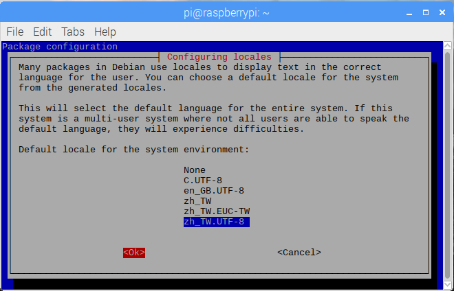

設定時區

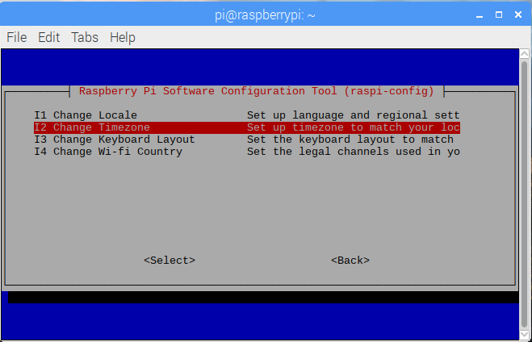

選擇Asia

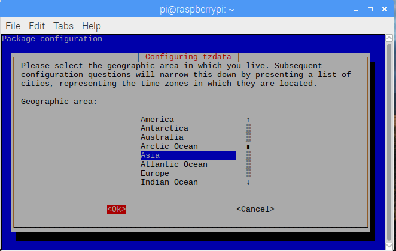

選擇Taipei

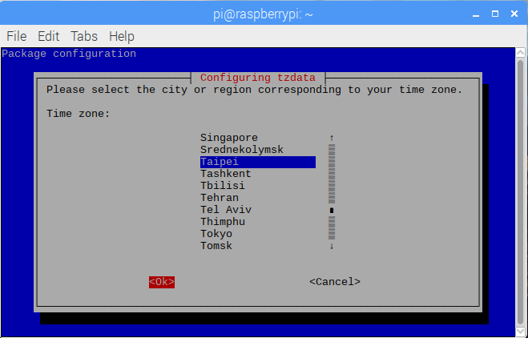

完成

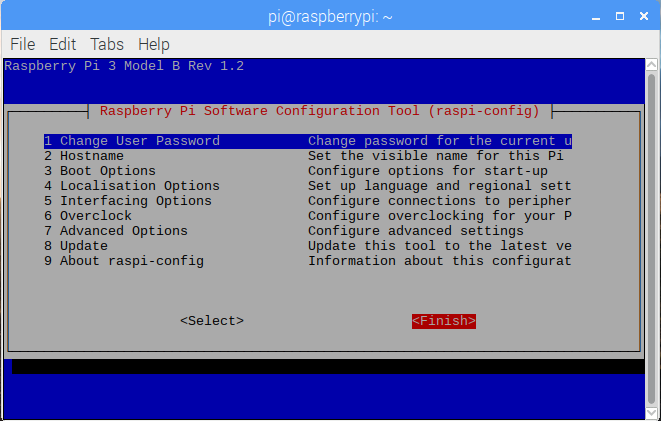

重新開機後環境變成繁體中文

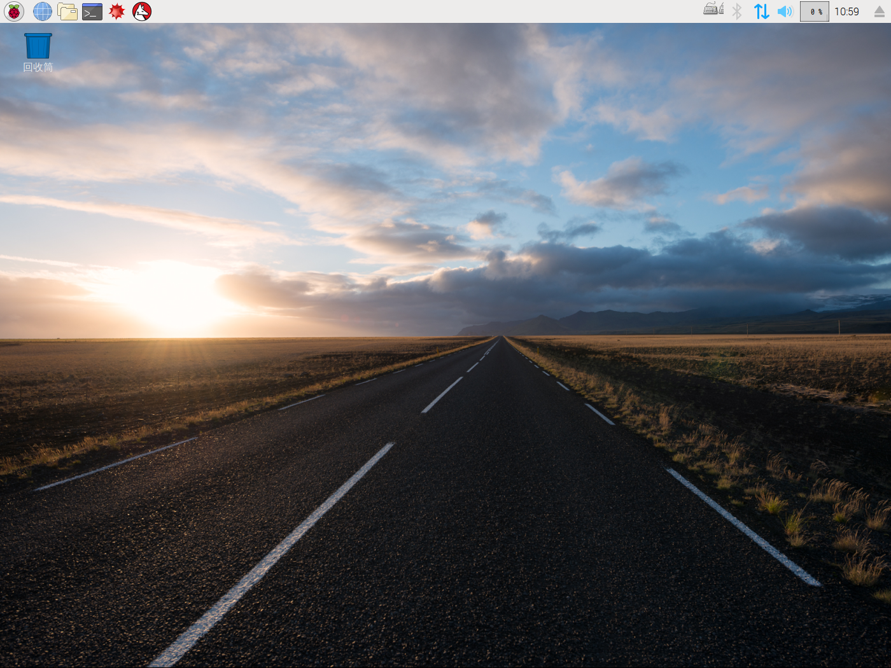

***

安裝輸入法

`sudo apt-get install scim scim-tables-zh scim-chewing scim-gtk-immodule im-switch`

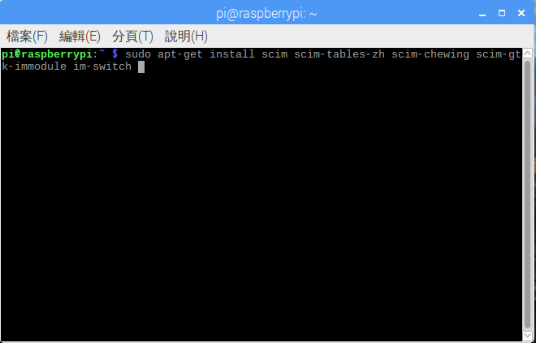

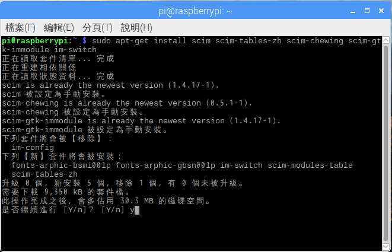

Ctrl+Space切換輸入法

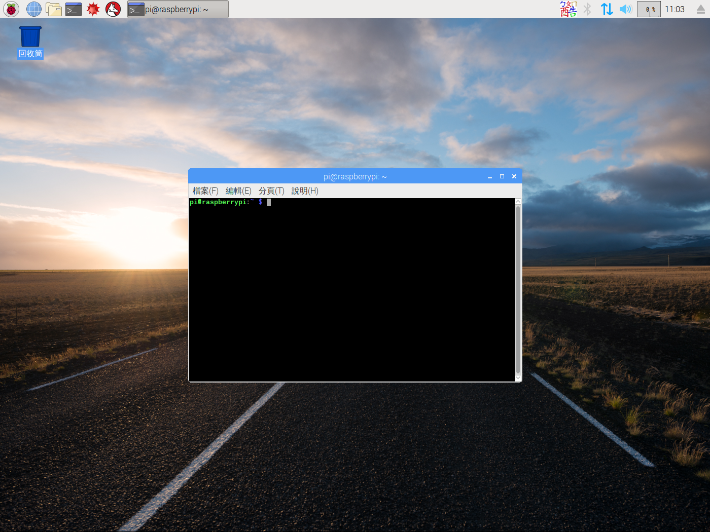