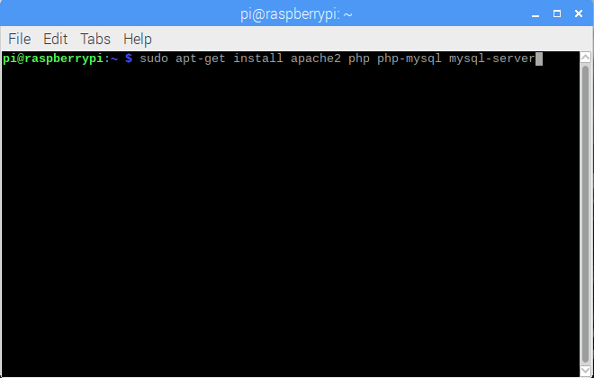
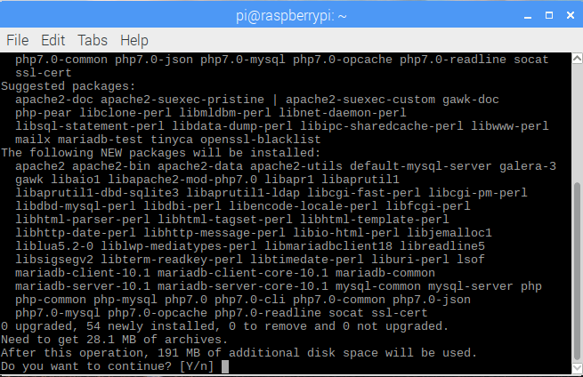
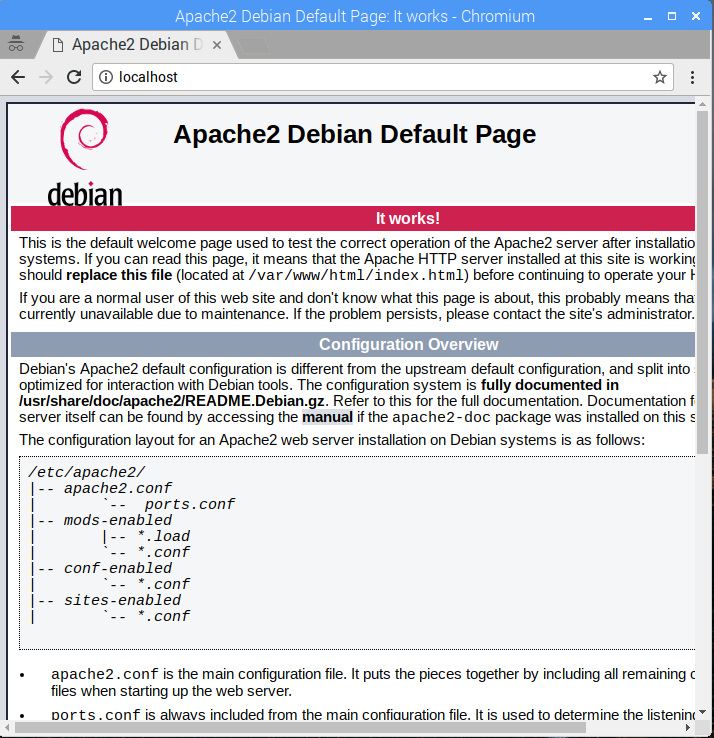
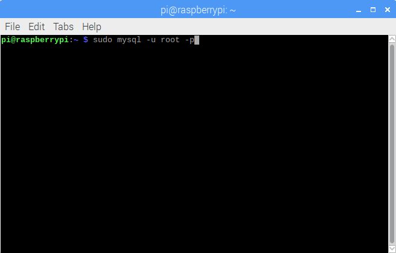
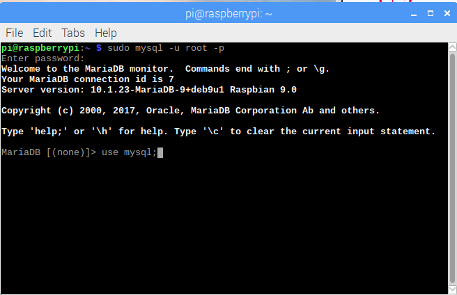
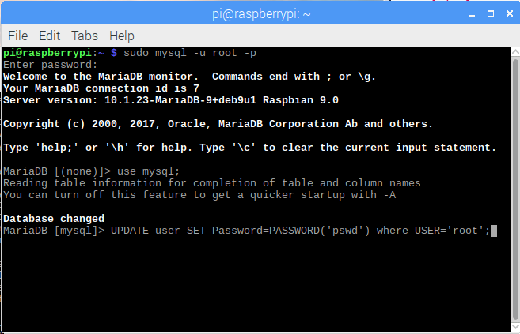
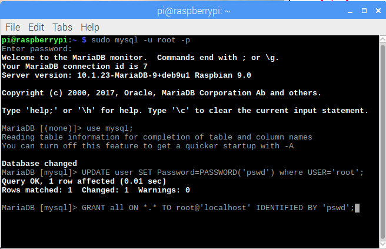
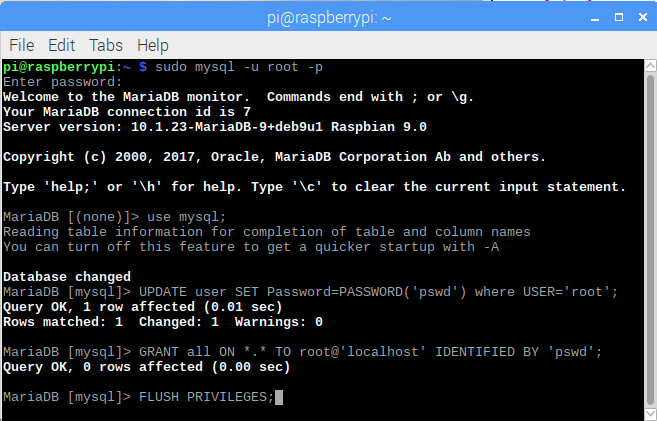

#03_webserver

架設網頁伺服器

***

安裝apache2,php,mariadb

`sudo apt-get install apache2 php php-mysql mysql-server`

安裝確認

開啟瀏覽器在網址列輸入localhost或者IP

***

進入資料庫並修改密碼

`sudo mysql -u root -p`

選擇mysql資料庫

`use mysql;`

修改root密碼

`UPDATE user SET Password=PASSWORD('pswd') where USER='root';`

修改資料庫權限

`GRANT all ON *.* TO root@'localhost' IDENTIFIED BY 'pswd';`

刷新緩衝區

`FLUSH PRIVILEGES;`

