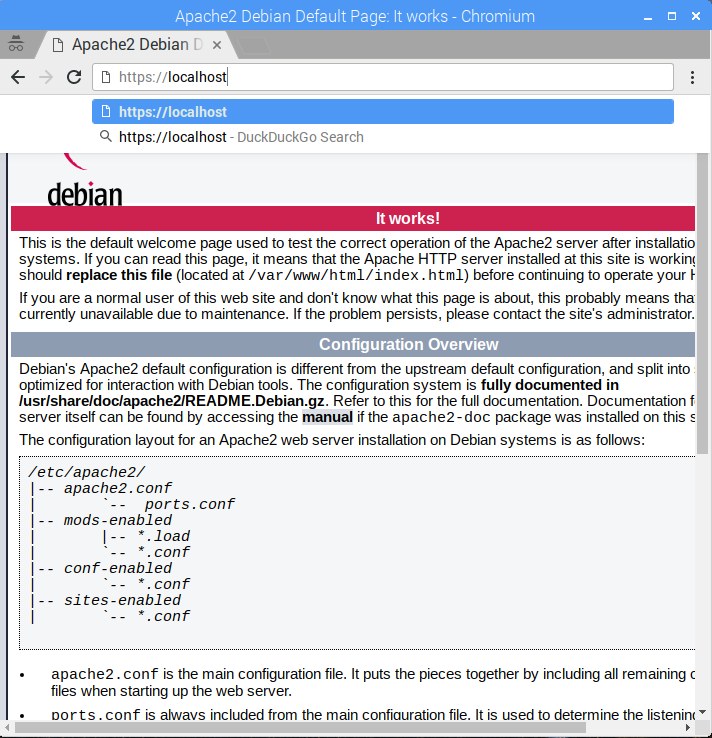

#04_https

如何建立憑證及在網頁伺服器上載入

***

建立資料夾

`sudo mkdir /etc/apache2/ssl`

建立crt及key

`sudo openssl req -x509 -nodes -days 3650 -newkey rsa:2048 -out /etc/apache2/ssl/server.crt -keyout /etc/apache2/ssl/server.key`

建立憑證時所需輸入的資訊

啟用ssl模組

`sudo a2enmod ssl`

連結sites-available/default-ssl.conf到sites-enabled/000-default-ssl.conf

`sudo ln -s /etc/apache2/sites-available/default-ssl.conf /etc/apache2/sites-enabled/000-default-ssl.conf`

編輯sites-enabled/000-default-ssl.conf

`sudo nano /etc/apache2/sites-enabled/000-default-ssl.conf`

使用ctrl+w搜尋到要修改的位置，將剛才建立好的crt及key填上

重新啟動apache

`sudo /etc/init.d/apache2 restart`

開啟瀏覽器在網址列輸入https://localhost

跳出安全性確認

瀏覽網頁

