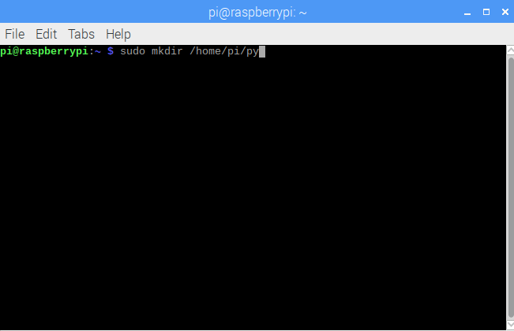
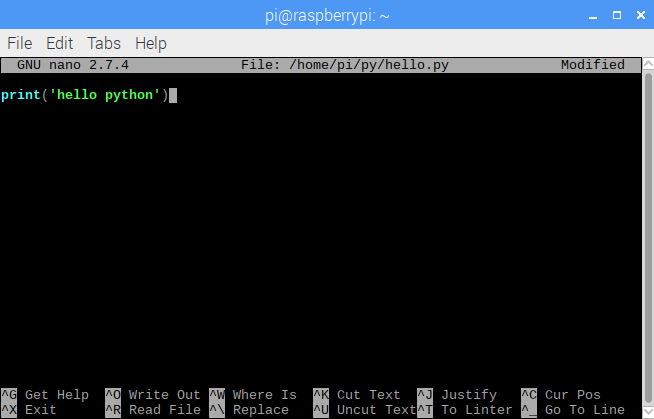
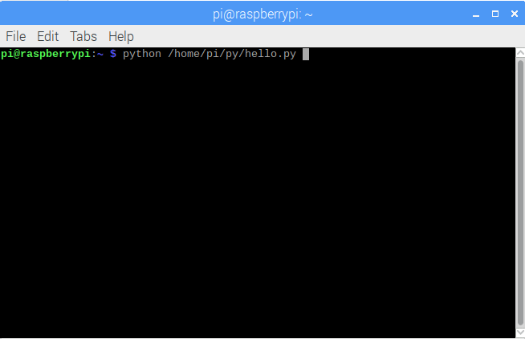
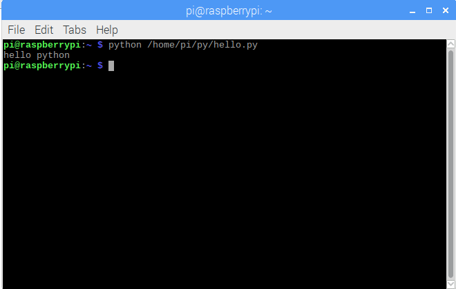

#05_python_01_hello

建立一個python的hello程式

***

建立資料夾

`sudo mkdir /home/pi/py`

建立hello的py檔

`sudo nano /home/pi/py/hello.py`

輸入程式碼[code](src/hello.py)

使用python執行程式

`python /home/pi/py/hello.py`

執行結果

